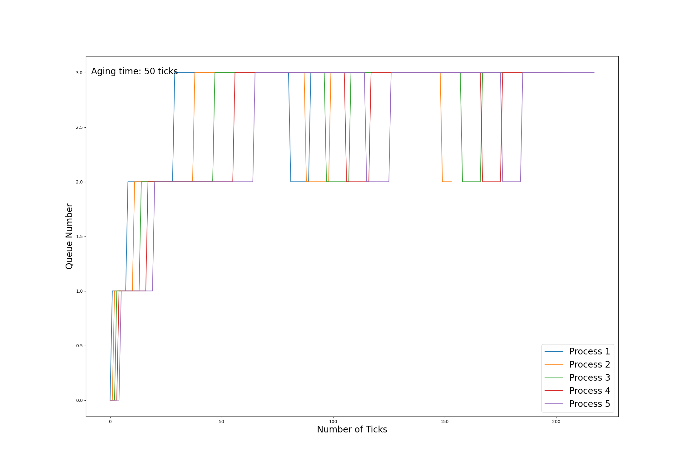

## Implementation of Scheduling Algorithms
### Round Robin
#### Explanation

#### Implementation

### First Come First Serve
#### Explanation

#### Implementation

### Multi-Level Feedback Queue
#### Explanation

#### Implementation

## Performance Comparison

|         Scheduling policy         | Average run time | Average wait time |
| :-------------------------------: | :--------------: | :---------------: |
|          Round Robin (RR)         |        10        |        142        |
|   First Come First Serve (FCFS)   |        10        |        120        |
| Multi-Level Feedback Queue (MLFQ) |        10        |        134        |

## MLFQ Scheduling Analysis

